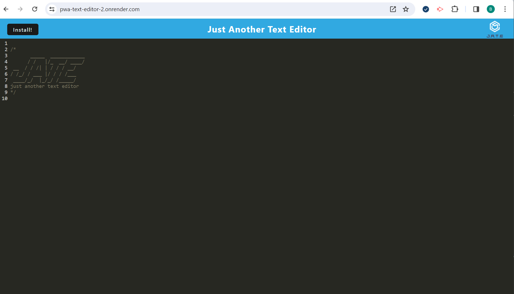
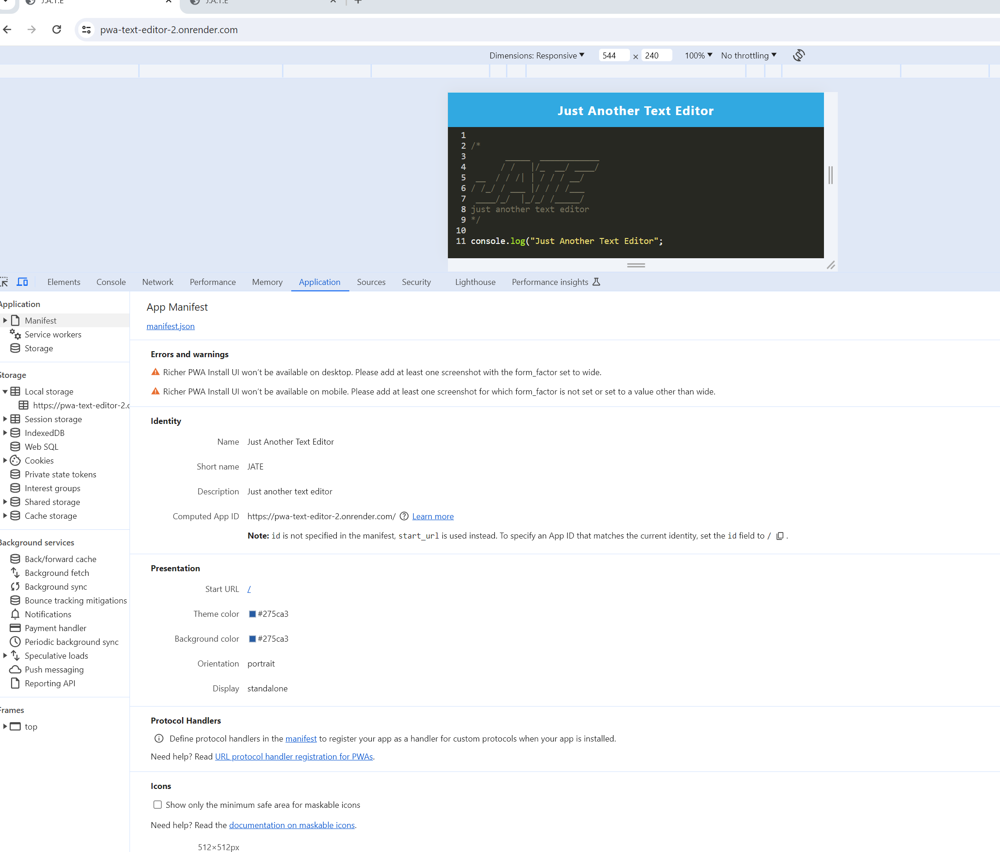

# Just Another Text Editor  

## Description 

This application will let you create notes or code snippets with or without an internet connection SO THAT You can reliably retrieve them for later use.

## Table of Contents

- [Title](#title)
- [Description](#description)
- [Installation Instructions](#installation-instructions)
- [Usage Information](#usage)
- [Contribution Guidelines](#contribution)
- [Test Instructions](#test-instructions)
- [GitHub Username](#github-username)
- [Can be reached at](#email)
- [Laguages](#languages)
- [License](#license)
- [License Link](#license-link)
- [License Section](#license-section)
- [License Badge](#license-badge)
- [Link to the Site](#site-link)
- [APP Screenshot](#app-screenshot)

## Installation Instructions 

npm install --save

## Usage Information 

WHEN I open my application in my editor
THEN I should see a client server folder structure
WHEN I run `npm run start` from the root directory
THEN I find that my application should start up the backend and serve the client
WHEN I run the text editor application from my terminal
THEN I find that my JavaScript files have been bundled using webpack
WHEN I run my webpack plugins
THEN I find that I have a generated HTML file, service worker, and a manifest file
WHEN I use next-gen JavaScript in my application
THEN I find that the text editor still functions in the browser without errors
WHEN I open the text editor
THEN I find that IndexedDB has immediately created a database storage
WHEN I enter content and subsequently click off of the DOM window
THEN I find that the content in the text editor has been saved with IndexedDB
WHEN I reopen the text editor after closing it
THEN I find that the content in the text editor has been retrieved from our IndexedDB
WHEN I click on the Install button
THEN I download my web application as an icon on my desktop
WHEN I load my web application
THEN I should have a registered service worker using workbox
WHEN I register a service worker
THEN I should have my static assets pre cached upon loading along with subsequent pages and static assets
WHEN I deploy to Render
THEN I should have proper build scripts for a webpack application

## Contribution Guidelines 

N/A

## Test Instructions 

N/A

## Questions 

https://github.com/bereto2008

### How to reach me with additonal questions: 

bereto2008@gmail.com

## Laguages 

HTML, CSS, JavaScript, nodejs, express.js, and webpack

## License 

The MIT License

## License Link 

https://opensource.org/licenses/MIT

Please refere to github The MIT License license or to click the link above

## Link to the Deployed APP 

https://pwa-text-editor-2.onrender.com/

## APP Screenshot 

